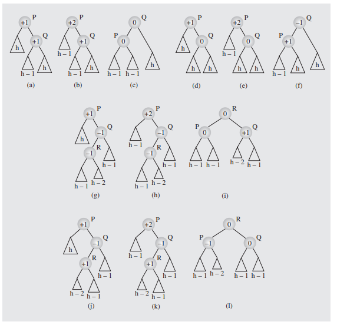

The main draw back of a normal binary tree is the insertion time
for the tree. The goal of an AVL tree is to decrease that insertion time
while still maintaining a semi efficient search structure.

---

## The Basics

1. ### Balance Factor
    key to the idea of an AVL tree is the balance factor of the tree
    
    every node in the tree has a balance factor.

    to compute the balance factor of a node, subtract the height of the
    left tree from a given node from the hieght of the right tree of a given node.

    the following is an image of an avl tree with balance factors implanted on each of the nodes
    

    > To be an avl tree the balance factor must be 1,-1, or 0 for all nodes

    thus the above image is not a valid avl tree

2. ### Insertion
    When we insert a new node into an avl tree, there is the chance that the resulting tree will no longer be a valid AVL tree.

    Concider the following.    

    

    this example occurs when we insert a node to the RIGHT of Q
    and can be solved by simply rotating ([[DataStructures.BinaryTrees.Balance.Rotation]]) P and Q

    Of course we don't have to insert ot the right of Q, we could also insert to the left
    
    

    when we do this, we must rotate a node in the sub tree of Q (R) with Q and then with P in order to fix the tree 

    > The previous cases are the only two cases that can occure when inserting into an avl tree

    > Note that they are symetric when fliped about their y axis

3. ### Deletion

    deleting nodes from an avl tree is a bit more involved than inserting them, as there are more cases to concider for rotation
    
    The following is a list of deletion casses for an AVL tree

    

    Note from steps H to I there is an inbetween rotation given in this image 
    
    

    the same double rotation trick is used for steps k and L
    
    indeed it appears that for both k L and H I a double rotation is used in order to move R to the center of the tree

