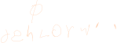
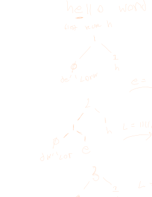
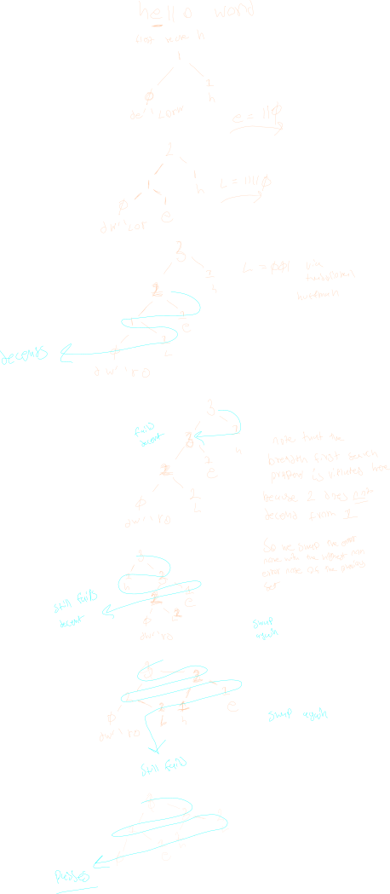

## About
consider a server transfering over a file to a client

If the file is very large, it would be 
inconvinent to have to scan through the ENTIRE file and construct the huffman code BEFORE sending it over the network.

Whats more, the additional overhead of encoding data would also have to be sent, requireing more data sent over the network.

The goal of Adaptive Huffman is to address these concerns while still maintaining an approach that looks simillar to the traditional [[DataSTructures.Dynamic.Greedy.Huffman]] algorithm.

## Algorithm

>  **Note**
> there are more than one version of adaptive huffman algorithms, the preceding algorithm is the one that was offered by svsu, but should be taken with a grain of salt, as further research is required to completly dissect this process

For the examples bellow we will use the string "hello world"

We start the algorithm with a single node in our tree that has an occurance rating of 0.

This node contains an ordered set of all possible characters that the message could send over and has an initial occuracne of 0, as at the start of the message

When we process a character from the input stream, we determine if we have not yet sent it (if it is in the initial letter set). 

If it is, we send over a number of ones equal to the characters place in the ordered set followed by a zero indicating it is **in** that set

Then we take that character out of the set, replacing its position with the last character in the set. 

We then place a node with its count as a sibling of the node that it was split away from.

A diagram of this process is shown bellow.

Note that a new parent is created if none already exists, and the parents count **must** be updated to match the sum if its children counts after the process. In this case, since 0+1=1, the parent has a count of 1.

In the case the node is not in the empty set, then we traverse the tree until we find that character, and send over the tracersal code equivilient to the [[DataSTructures.Dynamic.Greedy.Huffman]] case **and incriment its count by 1**.

Now, in addition to the previously mentioned properties, an addaptive huffman tree must also maintain the property that all counts in a [[top down right left traversal|DataStructures.BinaryTrees.Traversal#breath-first-search]] are in **decending** order.

If after inserting a new node or increasing the count of a node this property is ever broken, the node that violates this property must be swapped with the last node with the next highest property.

We continue the above example to see what happens with the letter 'L'.

