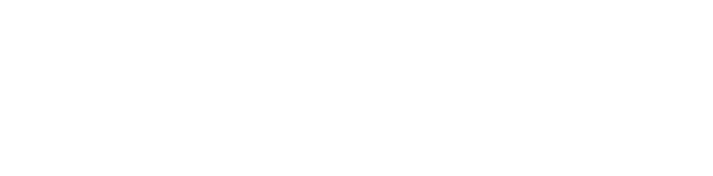

> rap tap tap tenno
    - The man in the wall

___

## Definition

Once we have concidered the [[IntegerCalc.Difference]] operation, a logical next step is to ask the question "what function f has a difference g"

This function is defined to be the anti difference.

That is to say:

> the anti difference of $$f$$ is the function $$g$$ s.t.

Much like the difference operation, we can think of the anti difference as an operation which takes in a function and returns a function. 

We shall notate this operation as follows.

Note that since by definition, the anti difference of a function is a function who gives us difference f,
the difference function cancels the anti difference function!

___

## Summation Via Anti Difference

The most useful feature of the anti difference is its relation to repeated summation of sequences.

> The anti difference of a function, is the summation of that functions output sequence 

bellow is a proof of this fact.

