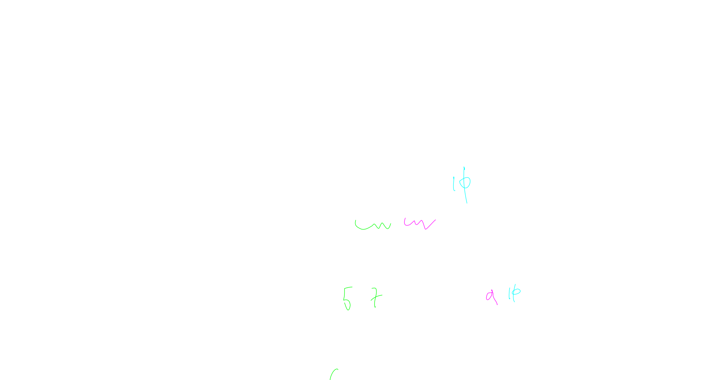
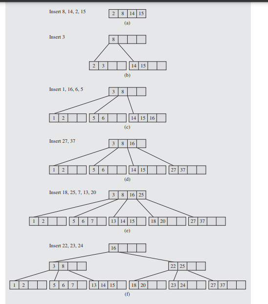
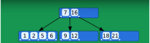
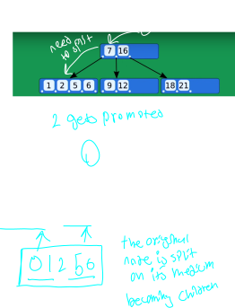
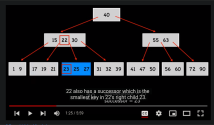
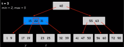
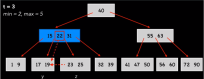
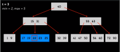

___

## About

this is a special case of m tree

it was invented to deal with slow operations on disk drives that binary trees couldn't interact with, because the binary tree could load all the operations in memory at once.

When working on the hard drive our requirements differ significantly from working in memory. 

**enter B Tree**

## Properties

- the root has a minimum of two sub trees unless it is a leaf

A B tree is an m tree wit several specific properties enforsed by insertion into the tree.

One of these properties is that all leafs are in the same level.

AAdditionally every node in the tree must have a minimum and maximum number of entries based on a global tree value that we will call T.

Every node must have at least T - 1 keys and at most 2T - 1 keys. The exception to this rule is the root.

## Insertion

we continue this process if the parent also needs to be split when inserting the new node into the parent.

Contunue doing this recursivly until the datastructure is updated.

When we insert we aim for the leafs, and proceed to go down the tree until we get to one.

## Deletion

deletion functions as the inverse algorithm of insertion, in the case that we have less than half keys full in any node, we need to **merge**

## Remarks

A leaf will allways have one more child than keys that it has, you can see this in the pointer structure of the leafs.

every leaf in a b tree contains nodes that are less than the value **before** the pointer to the tree and greater than the value **after** the pointer to the tree.

note how 9 and 12 are less than 16 and greater than 7

### Spliting

when we find ourselfs inserting into a leaf node that is already full,

We split the node on the **middle** value.
This middle value gets promoted to the parent in the appropriate order, and the leaf nodes get added as pointers to the parent.

If the parent then has two many numbers inside of it, we repeat this process on the parent node.

### Inserting

the following contains an example of the above tree inserting 0, and highlights how the tree is then split, and middle node moved to the parent.

Note that since 2 is the median of the leaf node we insert into, it is the number that moves to the top of the tree.

Note that this process would continue recursvly up the tree if 2 would overflow the root node.

In the event that we need to promote a node **past** the root, we create a new root!

### Deletion

#### Predesesor Verses Successor

the successor of an entry in the tree is the number imediatly to the right of it,

the predecesor is the number imediatly to the left of it. 

Because of the way that kb trees are structured these will allways be to the left and right in child nodes.

In the above image 23 is the sucessor to 22
and 19 is the predecessor.

#### Promotion

When deleting a b tree, you can promote the successor and predicesor to take the place of the key that you are going to delete in order to maintain properties of the tree, by moving them into their parent.

For example in the following image if you were to delete 22, you could promote 23 or 21 into 22's spot.

They would "move up the tree" so to speak.

#### Deletion Concepts

when you delete a node from the tree, you need to maintain the T restriction propertie.

There are several different cases when deleting that need to be accounted for.

    1. Simple Case 

If you delete a key from a leaf that has the proper number of keys, simply remove the key from the node outright

    2. Children Are Non Minimal

Case 2 occures when you are deleting from a parent node who has "rich children". That is, the children can spare a node.

In this case, we simply promote one of the entries from the children up to the parent.

For example, if we were to delete 22, notice that the blue child has more than the minimum number of nodes for this tree, we could then promote 23 to 22's location and maintain the searching properties of the tree.

Note that this technique works if you need to promote the predecessor as well as the succesor.

    3. Children are minimal (scary case :p) 

In case 3 when you are deleting from a parent who has "poor" children. That is to say, the children cannot spare a node.

The trick here, is that we can the two poor children together to make a new node which is large enough to delete from.

In the following example we want to delete 22.

Notice how neither of the nodes children contains enough keys to safely lend one to the parent.

Thus we merge the two nodes and the key we want to delete into **one** node.

these nodes get merged into a "super node"
containing more keys then it should be able to.

we can then delete 22 like normal.

We might need to use this case recursivly, working our way down the tree to get to the key we care about.

    4. rich sibling 

Case 4 occurs when the parent can support having more elements, and the child leaf node that we want to delete from is poor enough that deleting an element from it would make it invalid AND the sibling of that node has a key to spare.

In this case, we loan out a node from the rich sibling to the poor sibling, by demoting an element in the parent and promoting an element from the rich sibling.

## References

### Insertion

[full stack youtube](https://www.youtube.com/watch?v=C_q5ccN84C8)

[MIcheal Sambol youtube](https://www.youtube.com/watch?v=tT2DT9Z4H-0&list=RDCMUCzDJwLWoYCUQowF_nG3m5OQ&index=2)

