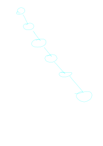
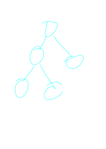

> "Perfectly Balanced, as all things should be"

*-Thanos*

---

## Forward
the reason that we use binary trees is because they are efficient for search algorithms.

However, not every tree is equally efficient.

concider the following tree

in order to get to the last node in this tree, one must first go through **EVERY OTHER NODE**. Clearly this is not efficient

A much more reasonable approach to storing these nodes would be to do so in the following configuration

in this configuration we can find our needed node in logarithmic time, verses the linear time required of the "stick tree"

we call such trees "balanced" and
a significant amount of effort is spent
in understanding algorithms that convert
the stick tree into the balanced one

> A Binary tree is only efficient if it is well balanced
