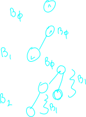

## About
these are different from binary trees!
don't be confused :p 

their definition is recursive:

binomial tree 0 is a single node

a binomial tree of n is the uniuon of all n-k binary trees up to n-k = 0

When we unioun them we add one tree as the left child of the other tree.

The bellow example contains B0 through B2. Note how we create each tree by adding another tree of the same order as it's left child.

