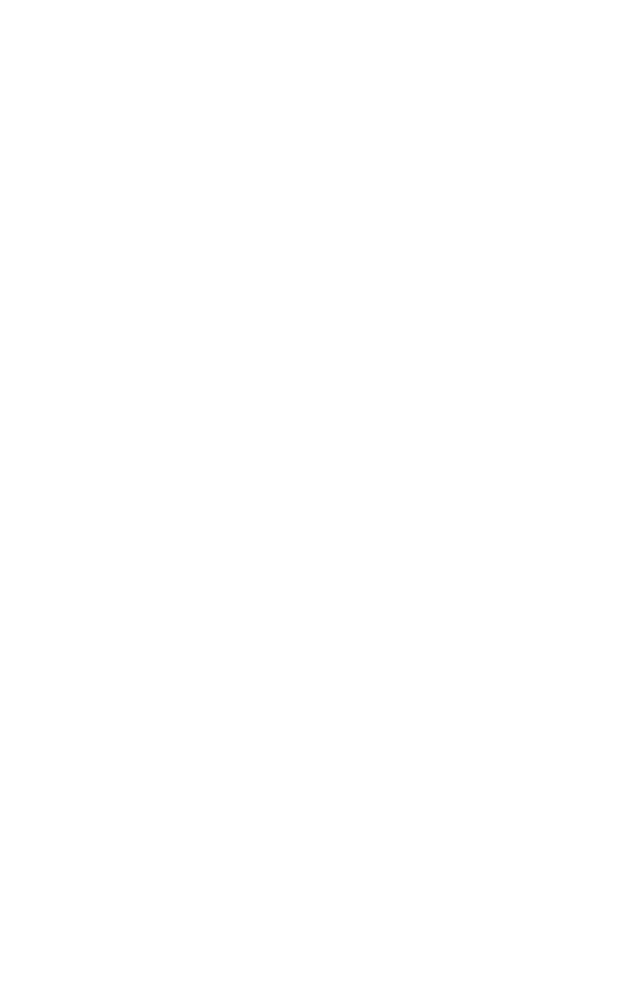
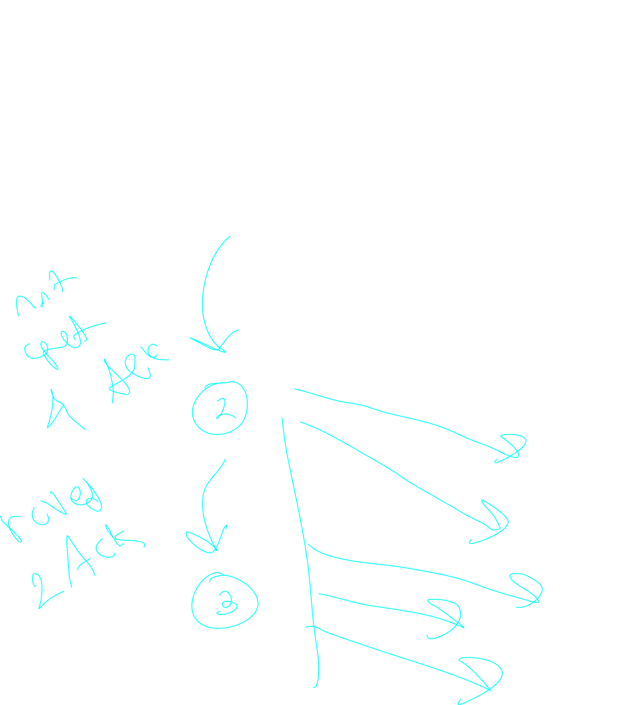
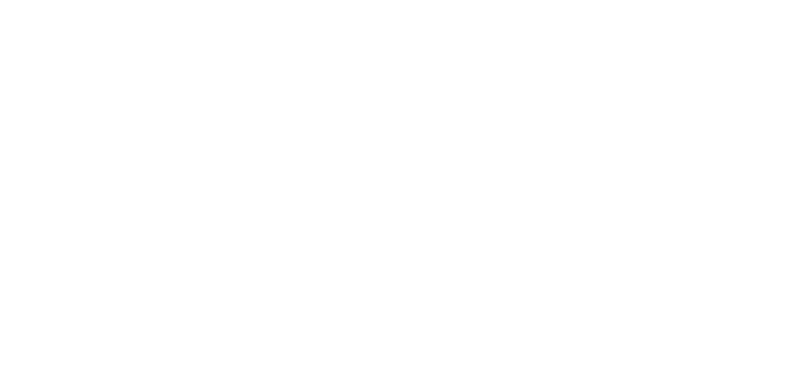
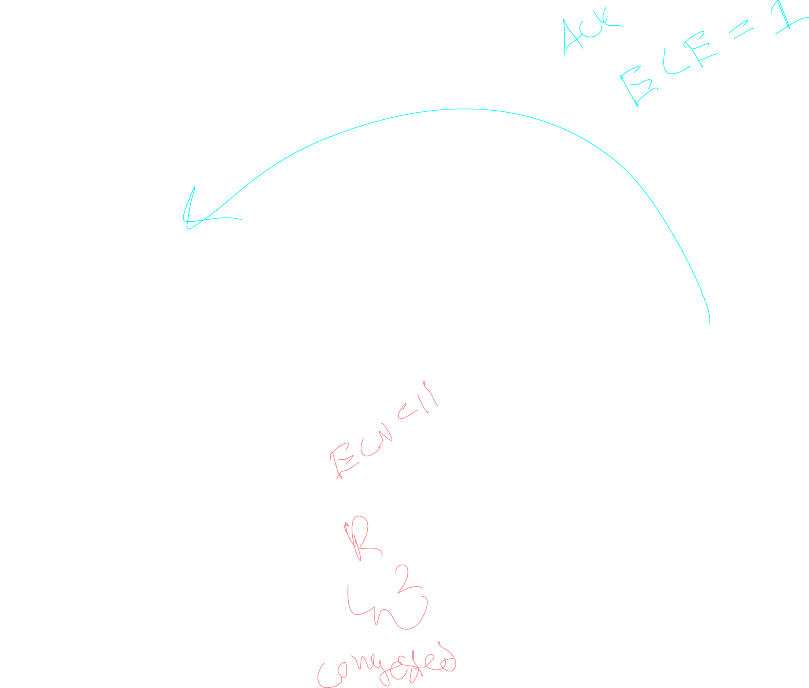

## About

informally "too many sources sending too much data too fast for the *network* to handle".

Congestion control is all about network delay, and getting the server to tell the client that the *network* is too slow.

> note that in [[Networking.Transport.TCP.FlowControl]] we send data about the state of the **server** buffer, in congestion control we send data about the state of the transit network

## TCP Slow Start

> This method is implicit, the client is only using information given via traditional tcp to set itself

The client gradually increases the packets that it sends to the server, adding 1 packet for each ack that we recive.

This has the effect of doubling the number of packets that we send.

the algorithm used to increase the packets bieng sent starts by sending na additional packet for each valid recived ack.

This has the result of doubling the number of packets that are sent at every **sucessful step**

When an error is detected, the number of packets to send gets **halfed** to return to the previous step, and the client then prociedes to go up by 1 packet at a time as apposed to on ack every time

> in short, additivly increase the segments sent, then half when you have congestion

when you graph this, you see these saw waves where they increase linearly until halfing at each awk

## Explicit Congestion Notification (ECN)

> This method is **explicit**, the server sends the data to the client indication that it is slamed

the network layer (ip) contains a flag called ECN that is initilized to 00

when a router is congested, it sets the ECN to 11

when the server responds to the client they set the ECE bit in the ack segment to notify the client

note only the congested router sets ECN

