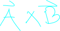
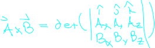
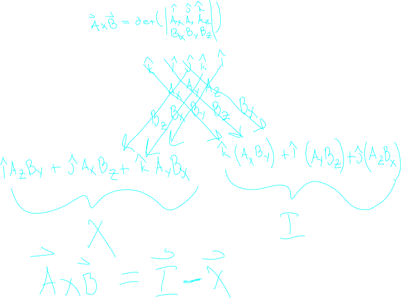

## About

the cross product represents a vector which is perpendicular to two other vectors.

As such it is only valid in 3d space (with the odd exception of some other riduculus dimension like 17 or something)

we notate the cross product as follows

## Computation

The cross prouduct is the result of an odd determinent where we use i hat j hat and k hat as values in the matrix.

We can evaluate this using the [[determinent]] for coputing determenents to get the following:

Since this is a mouthful to remember, it is often more useful to just remember the determinent definition along with the [[trick|matrixAlgebra.determinent#3d-trick]] to compute them.
