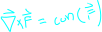
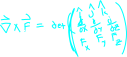
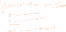

## Definition

see [[determinent]] for a quick way to compute this

## About

Curl is a mesurment of how a vector field is rotatating at a given location.

We compute it by taking the cross product of the [[determinent]]

## Surface Computation

we often want to find the curl of an 
entire surface embeded in some vector
field.

For a small square rotating in the field we can take the normal of that square doted with the curl of the field to get how much the square is rotating. 

Using integration to do this for an entire surface gives us the following integral.

