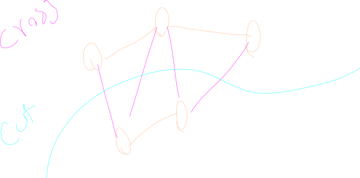

## About
to cut a graph is to make a partition of the nodes in the graph s.t. each node is in either partition.

## Pragmatics 
when we cut a graph, we can concider all edges that "cross" the cut

we only need one of those to connect the graph, so if we choose the "best" edge we will maximize the "goodness" of the graph! 

This could be minimizing distance, maximizing throughput or whatever we feel like, it lets us find the minimal connections!

### Spanning Tree Application

We can use this to build minimal spanning trees by cutting around our current selection for trees, and only including the minimum edges of our cut!

Note that to find this cut, we can simply include all edges connection from our current tree, out to other possible nodesadd the minimum of those edges to the graph and include its node in the tree

