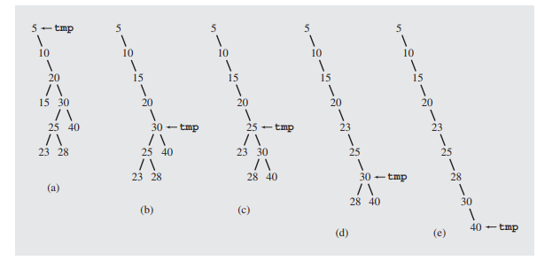
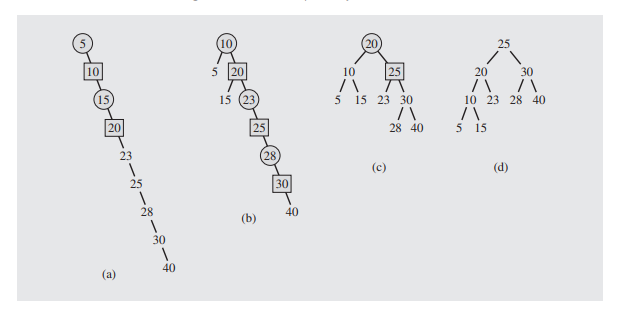

## Forward

The DSW algorithm is an algorithm for balancing an unbalanced binary tree.

The algorithm utilizes rotations to first build a stick tree, and then uses rotations to "unstick" the tree
into a new (now balanced) tree

---

## Algorithm

### The Backbone

The first step in the algorithm is to create a single stick tree using rotations.

the pseudo code for the algorithm is given bellow

    start with current on the root node

    while current != null
        if current has left child
            rotate current and the left child
            
            set current to that child
        else
            current = right child

the following is a visual run down of the algorithm using tmp in place of current.

### "Un BackBone"

once we have the tree in a backbone state
we can begin to unspool the tree

the algorithm for unspooling is as follows

    let n = number of nodes
    let m = 2^floor(lg(n+1)) - 1

    make n - m rotations starting from the top of the tree

    while m > 1
        m = floor(m / 2)
        make m rotations from the top of the tree

the following is the unspooling algorithm performed on the previous example tree

