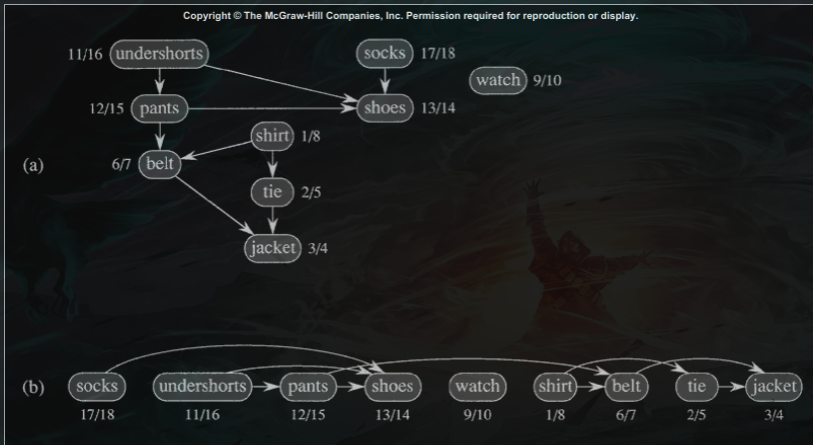

## About

DFS is a recursive graph traversal algorithm.

The goal is to visit every other node of the graph.

DFS does this by walking along node children and storing them in a stack as we go. When we can no longer walk along the path, we pop the stack and move to the previous node.

[Reducible DFS explanation](https://www.youtube.com/watch?v=PMMc4VsIacU)

## Topological Ordering

we can use DFS on a graph in order to make a topologists ordering on the graph

this is an order where we traverse the graph with no cycles, in an increasing manor.

You can think about it like finding the required order to take classes in a CS major, some classes depend on several other classes, and yet a single continous order needs to be uncovered, DFS does this for us.

Note that this algorithm is naturally recursive, and follows many patterns that we see in [[Binary tree traversals |DataStructures.BinaryTrees.Traversal#tree-traversals]]

## Algorithm

initilize the time to zero and all nodes to white

1. start with a node that has no incoming connections
2. increase time
3. mark the current node as bieng processed (change its color to gray), add it to the stack, store the current time in the node
4. if there is a white child, move onto that child and repeat the above steps
5. if there is **not** a white child, mark the current node as finished with processing, and return to the poped node from the stack, then repeat the above algorithm

what follows is an example of the algorithm where cyan indicates forwards traversal and purple indicates traversal via poped stack.

## Examples

a represents incoming data, note the numbers indicating the 
traversal order of the algorithm at each node

b represents the finalized topological sort and the "good" ordering of the data

## Remarks

note that we use the **second** number at each node to determine the nodes ranking in the topological sort.

with **higher** numbers indicating that we should visit that node **before** lower numbers.

you can see this more clearly by looking at the layed out topological sort in the above image.
