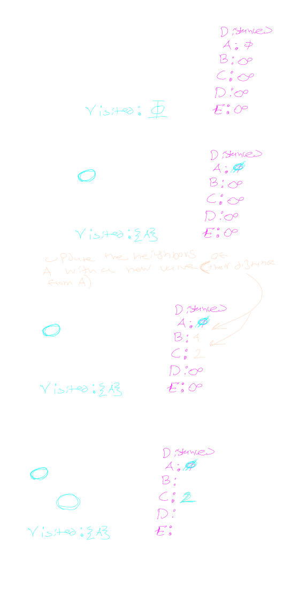

## About

Dijkstras algorithm is an algorithm for finding the shortest distance between nodes inside of a graph. 

Importantly the algorithm only works when the edges of a given graph have strictly posotive weights.

Note that the algo. finds the distance of each other node from a **single** given node.

see [wiki](https://en.wikipedia.org/wiki/Dijkstra%27s_algorithm)

## Algorithm

we will need to keep track of the distances of each node to the starting node, and which nodes we have visited.

Since we don't know the initial distances of any nodes, we assume that all distances start off as infinity except the start, which is 0.

1. Find the **unvisited** node with the shortest distance.
2. if the distance from this node to any of its connected nodes is less than the currently stored distance, replace that distance with our distance + our weight 
> we call this step **relaxing** the edge
3. repeat 1 and 2 until each node is visited.

### Example

## Remarks
This algorithm can be modified to result in slightly different behavior

If you care about shortest paths, then you can store the previous node along with the distance in the table (purple in the above pictures) and walk backwords to find a path.

If you want to find the distance to a specific node, then you can make the algo stop as soon as that node is visited, as disktras never visits the same node twice.

Changeing the data structures used to store the tables for visited and distance data can significantly impact the performance of the algorithm.

lots of stuff to fiddle with :).
