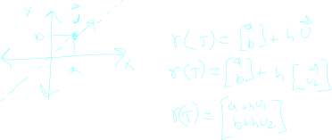
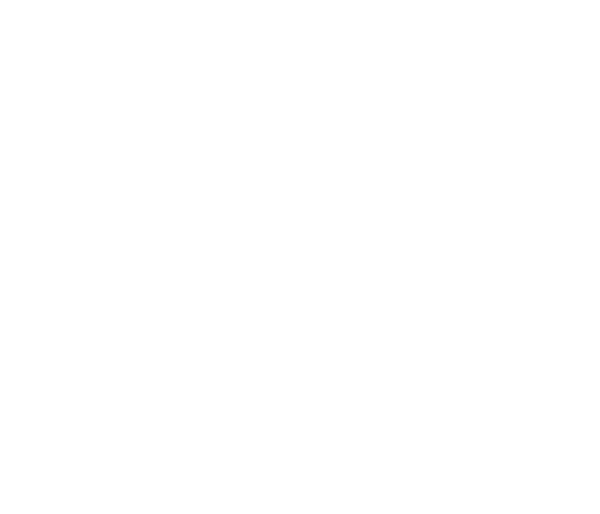

___

## Derivative Directions

once we pick a direction, we can 
take the slope on ANY function, because we can treat the multi dimensional functions as having a 2d SLICE with slope

we can use a unit vector to get this direction

concider the following line equation

if we take this line equation, and plug in this equation for x and y, we will get a function wich is restricted to ONLY the points on this line

this function has a single variable. And we know how to work with that! We can take the derivative of this function using traditional techniques.

We call this the directional derivative

> when you take the directional derivative make sure that U is normalized

### An Alternate Look

___

recall

we can think about this as adding adding a TINY nudge to each of our variables. h is that nudge. 

so what the directional derivative can be interpreted as, is the rate of change of the function, when we take a tiiiiiny nudge in the direction of U. 

### Examples

we can do the same thing with a different direction vector

note that we can treat the constant variable as a constant and run calculus like we are used to to get a sensible answer

in general we can ignore this complicated limit equation and use normal derivative rules while treating the other variables in the equation as constant

> We call these derivatives partial derivatives with respect to their variables

### Partial Derivatives And Unit Vectors

we can use the partial derivatives as unit vectors to find the derivative of ANY direction U.

Simply multiply each partial derivative by the corisponding component in U

however. this ONLY works if the function is differentiable

___

# Second Partial Derivatives

We can interpret higher order partial derivatives as the acceleration in the given direction.

We usually notate this a few ways:

but we do not HAVE to take the derivative with respect to the same function Concider

this tells us how the rate of change of f changes as we move along the y direction.

> We find this derivative using the same techniques as the partial derivative. But first we take with respect to x, then with respect to y.

*usually* this is true ^

we call xx yy zz second derivatives the pure second derivatibes and any second derivative using more than one variable a mixed seoncd derivative

