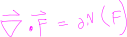
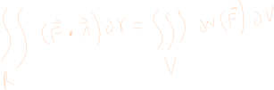
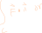
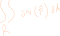
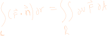

## Definition

#### Divergence Boundry therom

note that to find the normal, we use the cross product of the tiny nudges on the paramaterized surface, its the same technique as [[calc3.surfaceIntegral]]

## About

The divergence represents how much the vector field is expanding at the given point. 

It is helpful to think about the divergence like a measure of how much a certain "liquid" is created at a given point. Were posotive divergence indicates that the point is a source and negative a sink.

see [three blue one brown](https://www.youtube.com/watch?v=rB83DpBJQsE&t=844s) for an excelent online example of this.

## Volumne Surface Relation

There is a consise relationship between the divergence of a surface and of a volume.

concider some region of space and the amount of "liquid" flowing into and out of the region from some vector field.

We can think about the liquid flowing into the region as if it were filling a water balloon, and liquid leaving the region as if it were spilling out of a water balloon

With this in mind, notice that if more flow leavs the region than enters, we HAVE to have created flow inside of the region. Vice versa if less flow leavs.

Thus taking the line integral with the boundry of the region to compute the veector field leaving and entering the region.

Is in some sense telling us information about how each point INSIDE of the region affects the total flow of the vector field.

But we know how to compute the total "flow" on the inside of a region. We can use a double integral for that.

Thus for some bounding region on R we get the following relation.

We can make the exact same argument for the flow of a liquid filling some water balloon. In this case we get the following relation up a dimension.

Note that if dv is not dxdydz then you will have to account for how the paramaterization of the volumn changes the area of the little squares that the integral is computing.

> more research would be nice to confirm this, but I think that you can use the determinant of the output matrix of d/dx d/dy and d/dz of the paramaterization in much the same way as [[calc3.surfaceIntegral]]s use the cross product to re-normalize the area

> just replace the tiny little squares with tiny little cubes.

[Khan Academy](https://www.youtube.com/watch?v=XyiQ2dwJHXE)

