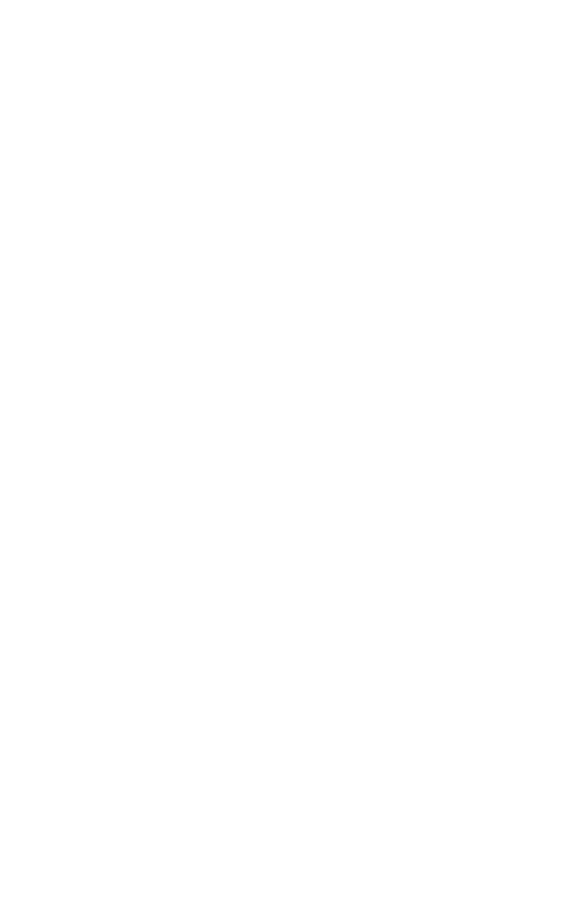

## About
in general the server constantly sends 
the amount of remaining space over to 
the client who updtes the amount of data that they send based on this amount and the amount they sent in transit.

the rwnd (recive window) simply contains the amount of bytes that are free in the reciver buffer.

