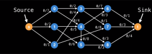

## About

A flow graph is a special kind of directed graph wich is used to represent flow through a network, much like water through pipes.

Each edge of the graph contains the current amount of flow moving through that edge (pipe) and the capacity of the flow that **can** move through that edge.

Typically the capacity and flow through an edge is repressented as f/c writen next to the edge. with F bieng the flow and c being the capacity. You can see this more clearly in the flow graph of the bellow image.

In flow graphs with one node that outputs all flow and one node that recives all flow, we say the output node is the source node, and the input node is the sink node.

## Properties

every node must have an equal amount of flow going into it and leaving from it.
