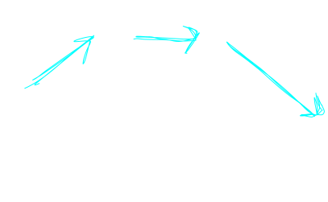

## About

the goal of the Ford Fulkerson algorithm is to find a maximum flow on a [[DataStructures.Graph.FlowGraph]]

That is, from the source of a graph to the sink of a graph, what is the largest flow that can be placed.

## Algorithm

We start with a flow graph with directed verticies that each have a given capacity.

we start with a flow graph.

using this graph, we find a path to the sink from the source

We push the maximum possible flow through this path.

But notice, how do we know that we picked a good path to send flow to, since there are lots of possible paths it very well could be the case that the path we picked was sub optimal.

To fix this fff algorithm uses somthing called an *augmented flow path* in this path. We make a seperate graph where arrows in the graph represent the remaining capacity of flow to travel along a direction. Critical is the fact that we represent back flow as flow which can be undone in this scond graph.

Bellow is a aughmented path of the graph above, where the cyan arrows represent back flow that can be undone, and the purple arrows represent forwards flow that can continue in the graph.

Notice how the cyan edges each have a backflow value of 3, as we sent only 3 flow through the network.

We then run the algorithm on this graph until we cannot find a path from the source to the sink with backflow or forwards flow.

## Example

note that the maximal flow in this graph is 19
