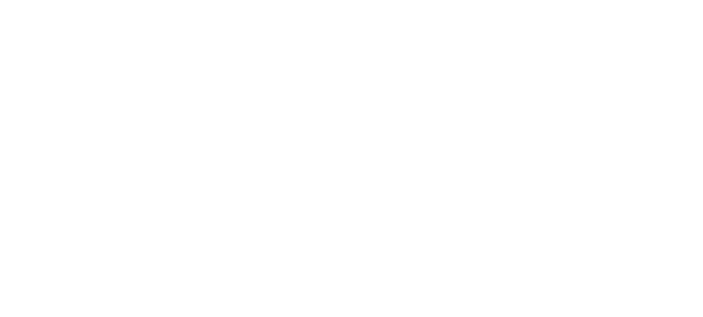
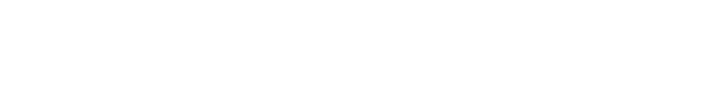
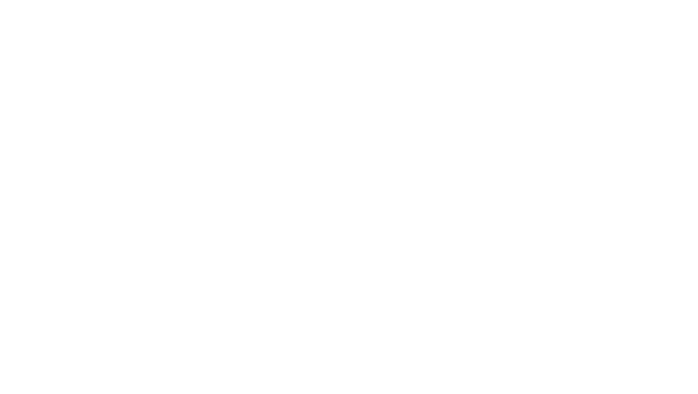
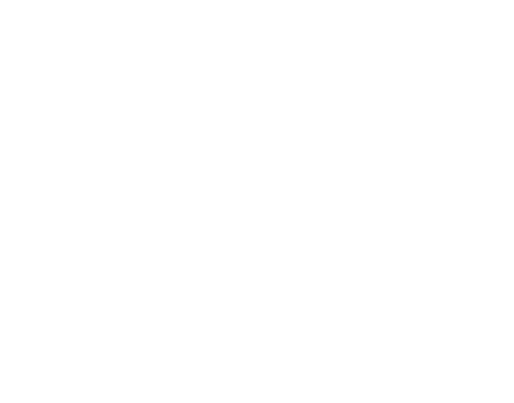

## Definition

the gradient vector of a **differentiable** function is a vector whos components are the [[partial derviative|calc3.multiVariable.derivatives.directionalDerivatives#partial-derivatives-and-unit-vectors]] of the [[calc3.multiVariable]] function f

## Ideas

The gradient vector tells us how much f changes with respect to each variable inside variable in the components of the vector.

This gives the gradient vector MANY useful properties.

> **CAUTION** this only works if f is continous

## Notation

we write it using the following notation

## Properties

1. the gradient vector points in the direction of highest accent
2. that means its negative points twoards lowest accent
3. its perpendicular points twoards no descent 
> so if we walk along perpendicular to the gradient, we get the [[ contour lines| calc3.multiVariable.visualization]]

4.

5.  gets the maximal rate of change

## 3D application

note that in this example we are using a function in 3d space, and taking the derivative of each of the points of that function with respect to an *implicit* variable

