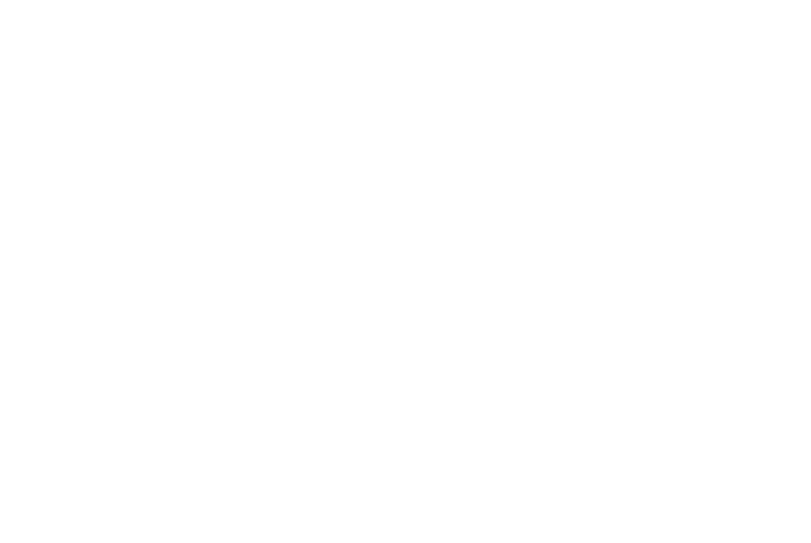

## Definition

## About

the hessian matrix is used to determin if a critical point is a (maximum,minimum) or sattle point. The determinent of the matrix tells us how the area around the given point behaves.
