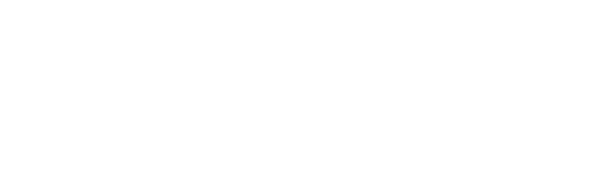

# Repeated Differentation

We can interpret higher order partial derivatives as the acceleration in the given direction.

We usually notate this a few ways:

but we do not HAVE to take the derivative with respect to the same function Concider

this tells us how the rate of change of f changes as we move along the y direction.

> We find this derivative using the same techniques as the partial derivative. But first we take with respect to x, then with respect to y.

*usually* this is true ^

we call xx yy zz second derivatives the pure second derivatibes and any second derivative using more than one variable a mixed seoncd derivative

Some extra notation

