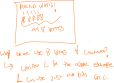
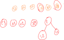
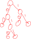

## About

This is a file compression algorithm
.zip winzip ect. use the huffman algorithm.

this is a lossless compression algorithm.

## Algorithm

in a regular file you have lots of characters that make up the file

if we use less bits per character, we save space. In particular the most common characters are the ones we want to replace the most!

we use trees to find this infroamtion

we start with a set of single leaf trees that are disconnected, including in t he trees the characters and frequency that they occure.

then we find the lowest occuring characters in the tree

and combine them into a smaller sub tree whose root node is the sum of the two lower frequencies.

once we do this enough (only concidering the root frequencies in each line) we will have a full tree containing frequency occurances.

we then set right edges of this tree to 1 and left edges to 0.

we use the path to a node from the root, labeled with these 1's and 0's to indicate its encoding.

A side effect of this encoding is that each node has a unique encoding that does not contain the prefix of any other node.

because of this we do not need any seperation marker for the tree!

## Remarks

note that the maping tree has to be stored with the image, if it is not then you couldn't unzip the file.

Note that the more repetition that you have in a file the more that the file will be compressed.

Further the huffman algorithm does NOT give you an optimum output. It's greedy, so it gets you reasonably close enough to an optimul solution.
