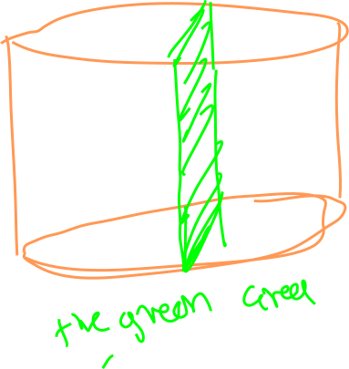

## Multi Variable Integration

consider a function with a 2d domain

we can [[calc3.multiVariable.visualization]] to see this as a 3d shape

a natural question to ask is what is the area of this shape

we can think about shredding the region into a bunch of little squares and adding together all of the "little collumns" of the function to compute the double integrals.

we can look at this still another way

## Partial integrals

note that this function will give you the area of a **slice** of the 3d solid that we are [[visualizing|calc3.multiVariable.visualization]]

a vertical slice if you will

 of the whole 3d region.

now imagin adding together all the infinit slices of the region

We can expand this to get

we call this form an iterated integral 

> sman calls it a scanning electron beam

note that we could replace x and y and get a valid equation.

## Examples

