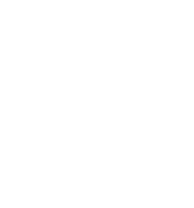
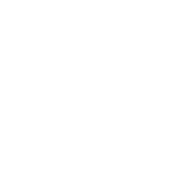
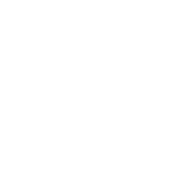
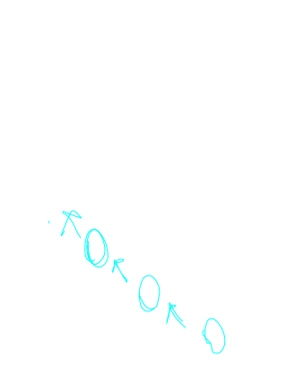

## About

The goal of this algorithm is to find the largested ordered intersection between two strings.

Note that you are allowed to skip characters when finding this length, so the letters in your sub matches can be skipped over.

This is an interesting analysis in orderings.

## Algorithm

Start by making a zero padded table for each of the two words that you want to test.

For examle for Nord and Dragon would get the following table.

Then loop through the table using the following logic.

1. If two characters match, set the cells value to one plus the maximum surrounding cells value, and point the cell diagonaly to the top left.
2. If they do not match, set the cells value to the maximal value of its immediate surrounding nodes (using rook movement for surrounding nodes.)

Performing that for the current rows leads to the following outcomes on the table.

Note that we ignore letter case.

> Notice how the only cell that points diagonaly is (D,d) this is because it is the only cell with a character match.

We then repeat this process for each row of the table.

doing this results in the following table.

We can find the LCS by starting from the bottom right corner of the table, and following the path, recording every diagonal motion that we make as we go.

The following table produces the longest common sub sequence of "O", which happens to be rather boring.

> Note that there are often multiple valid LCS's that we can compute for the given strings

> in the case of these strings we have O, R, and D as valid LCS's

If we try the same algorithm with the strings "Dog" and "Hot Dog" we get the following table.

Which results in the longest common sequence "dog".

## References

[programiz](https://www.programiz.com/dsa/longest-common-subsequence)
