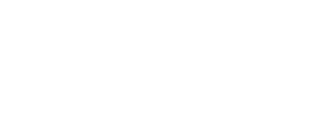
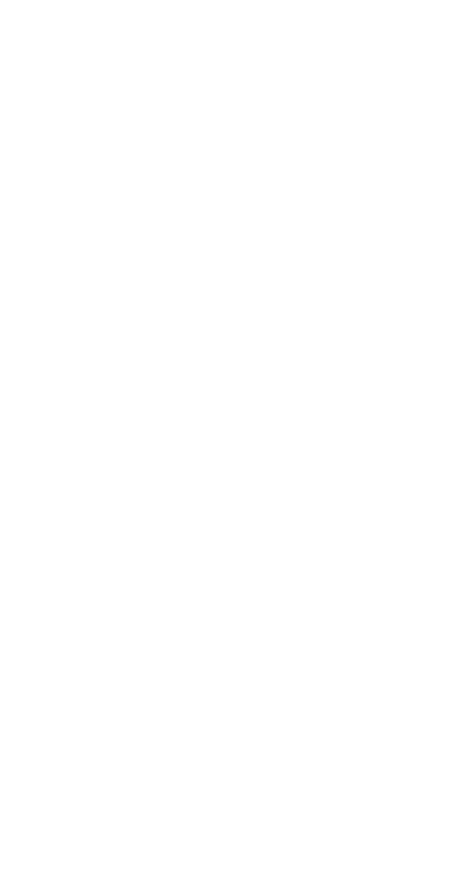
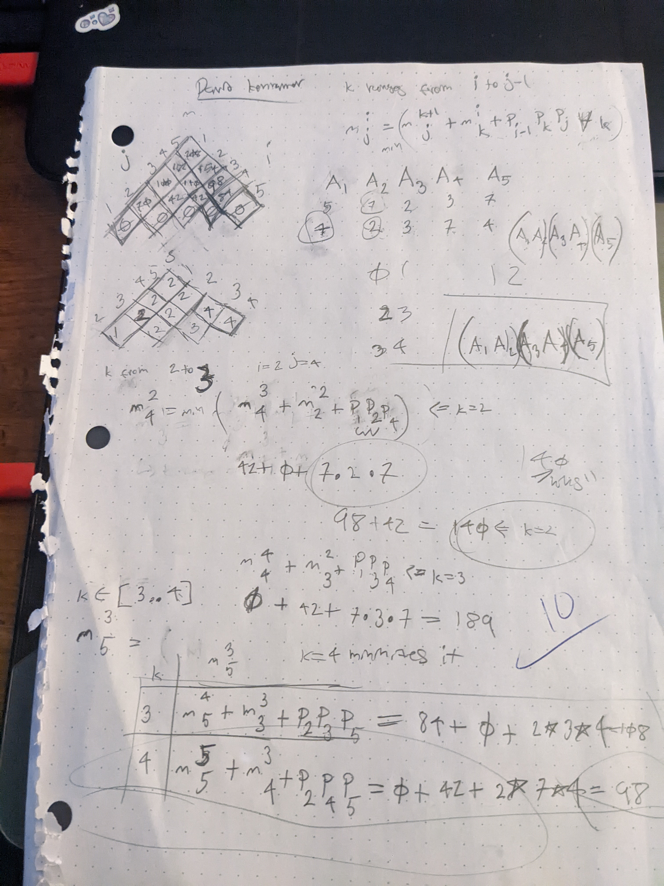

## About

what follows is an algorithm for efficiently 
multiplying together matrixies

## Algorithm

note that matrix multiplication can be processed in any order (parenthasis don't matter)

while the order does not determine the outcome of thte multiplication **it does** effect how many multiplications need to be performed effect how many multiplications need to be performed.

the algorithm uses two tables, with table m keeping track of the minimum
required for the multiplication and table s keeping track of the minimum value of k required for the multiplication.

## Example

