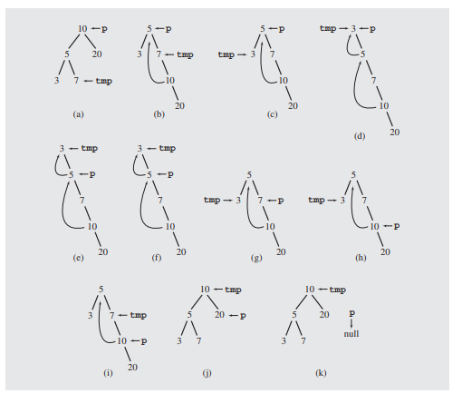

## Motivation

Many traversal algorithms involve the use of a stack.
This adds additional memory overhead to the program that we might need to avoid given large trees.

One potential sollution to this problem, is to use the tree itself as a datastructure to perform our algorithm on

**Enter Morris Transformation**

## Basics

note how if our tree is a "stick tree"
then we can efficiently visit every node of the tree using VR techniques and forget about recursion entierly.

> Notice how you can visit the tree by moving all right

The aim of the Morris Traversal algoritm is to turn a normal binary tree, into a stick tree, and then follow it to the right

the steps to do this are as follows

    1. set current to the root
    2. while not finished
        if current has no left descendant:
            visit it
        else: 
            (make current the right child 
                of the rightmost node 
                in currents left decendent)
            current = currents left decendent

the following shows a tree as the above algorithm is run on it

