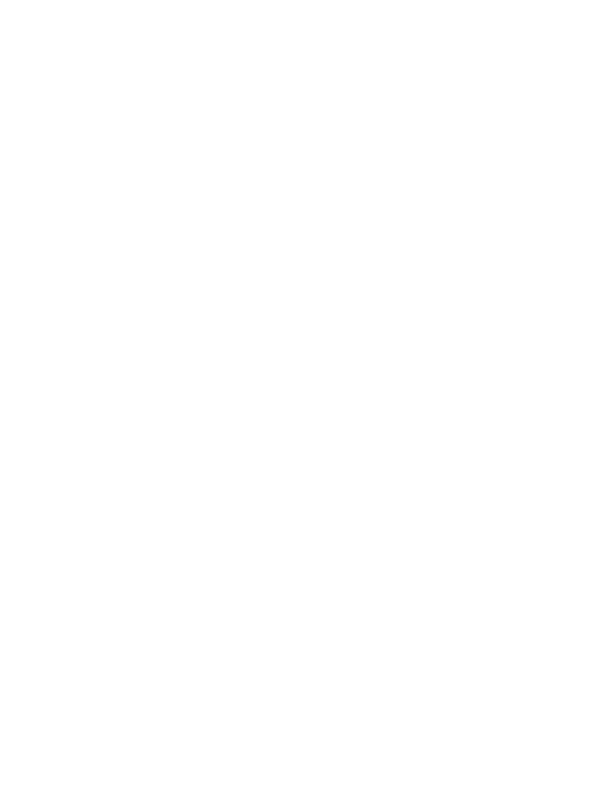

___

## Definition

Multi way trees are trees with more than two children.

> So we could have 3,4,5 or n children of one node

We call such trees an m-way tree

example of a 4-way tree

## Key Properties

each node in the tree may have n-1 keys used for ordering the node.

> so a 4-way tree may have **up to** 3 keys at any node

when inserting a node into the tree, we insert the node on the path *inbetween* two existing keys on the tree s.t. the prior < node < after with the edge keys going to the right or left respectivly.

