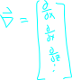

## About
an operator is a function that takes funtions as arguments and returns functions as outputs.

see [[IntegerCalc]] and basically all of [[calc3]] as an example

basically higher order functions.

## Gradient Operator

it is very common to need an operator which is a vector whose componenets are themselfs derivatvie operators, and as such there is a common operator called the gradient opperator that performs this task.

note that this is not the same thing as the [[calc3.multiVariable.gradientVector]], but rather an operator which we can use to get the gradient vector
