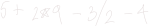
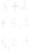

___

## About

Polish notation is a way to avoid using parenthasis in expresions.

concider

without order of operations, this is ambiguos. There is no way to know what order to perform operations in.

**we** know how to use order of operations to add parenthasis, but computers have trouble with this idea.

Lots of exptra computation is needed in order to treat order of operations.

**enter polish notation**

## Definition

Polish notation is a notation where we do not need to use implicit or explicity parenthasis, this nullifies the need for the computer to parse parenthasis.

there are three ways to represent functions on two arguments in a line

they are, in order

1. infix
2. prefix
3. postfix

