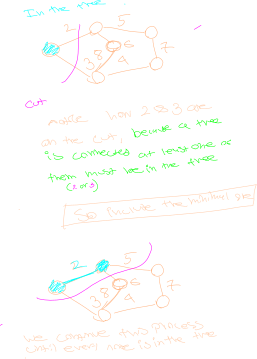

## Forward

The main idea of prims algorithm is to [[DataStructures.Graph.Cut]] the graph into two groups, one group bieng nodes that are in the tree, and then select a single edge that is across the cut to add an extra node to the group.

## Algorithm

1. Add a starting vertex to the tree
2. Find all edges on the [[DataStructures.Graph.Cut]] between the tree and the graph 
3. add the minimum of those edges to the graph and include its node in the tree
4. repeat 2 and 3 until every node is in the tree.

This makes much more sense to see visualy.

