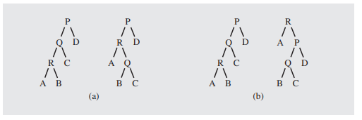

---
## About
Often times we spend a significant amount of effort rebalancing a tree either localy or globaly with [[DataStructures.BinaryTrees.Balance.DSW]] or [[DataStructures.BinaryTrees.AVL]]s respectivly.

However, since not every node of a tree is used with the same frequency, their very well could be a case where we want a slightly less balanced tree because some node N is referenced continously, and should theirfor be at the top of the tree.

## Implimentation

The ideas for this is very simple.

there are two ways this is implimented in practice.

1. every time a node is accessed, [[rotate|DataStructures.BinaryTrees.Balance.Rotation]] it with it's parent
2. every time a node is accessed, [[rotate|DataStructures.BinaryTrees.Balance.Rotation]] it to the root

the following is an example of this

a is a single rotation, b is a rotation to the root when accesing element R.
