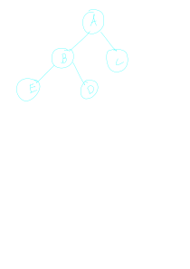
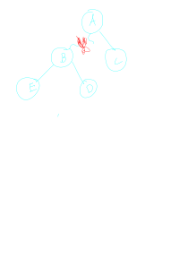
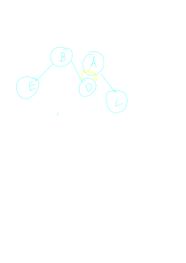
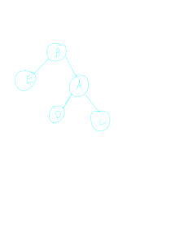

---

## What Is A Rotation

a rotation is an opperation which can be performed on the nodes of a binary
search tree **while maintaining the binary search properties**

because of this fact they are used extensivly in balancing algorithms
as rotations change the tree, while keeping it valid

## How To Perform A rotations

there are two kinds of rotations, left and right, and they are perfectly symetrical, so we will focus on right rotation.

concider the following nodes

if we were to rotate node A by node B,
we could imaging "cutting" the connection in between them

when we do this node A will *"fall"* and collide with node D

it will then take the place of D in the tree, with D bieng to the left of 
A in the tree

this is the final state of the tree after the rotation.

a left rotation is exactly the opposite, and occurs when B is to the LEFT of A, not the right

Notice how after the transformation, al nodes that are to the left of A to begin with, are still to the left of A

all nodes that are to the right of B are still to the right of B.

all this is to point out

> Rotations preserve tree ordering

