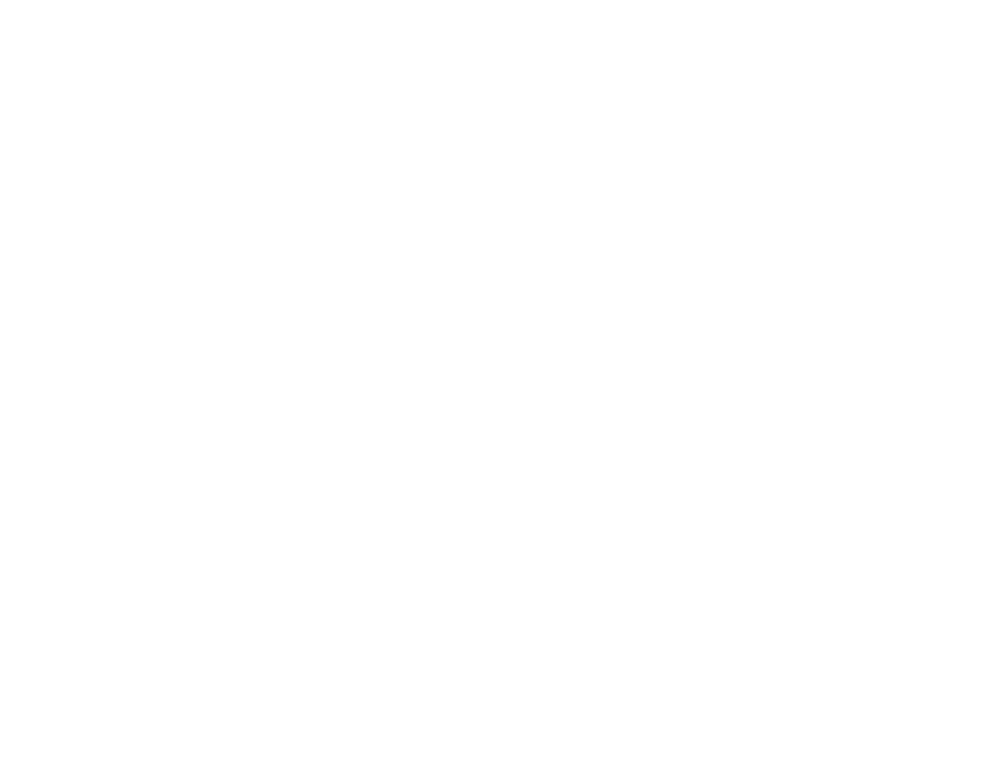
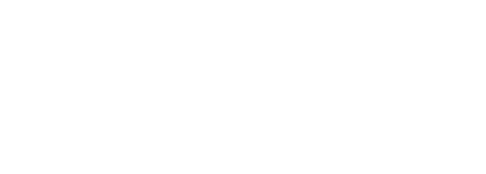
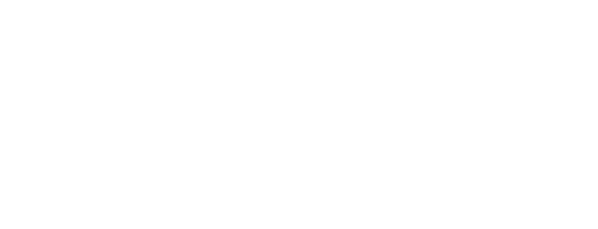
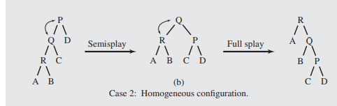
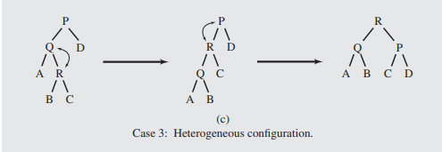

## About
Splaying is a modification to [[DataStructures.BinaryTrees.Balance.Rotation]] on a binary tree that can occasionally provide a more balanced tree when using a [[DataStructures.BinaryTrees.RestructureTrees#about]] when using a move to the root strategy.

Note that it might not **allways** be better than simply rotating, but that it "often" is according to teach.

> Further research is recommended for the above claim

## Lemma

The algorithm for splaying depends on a switch statement of 3 different cases.

when accessing node R the cases are as follows.

> note that for brevity Q is r's parent and P is Q's parent.

1. R's parent is the root

2. *Homogeneous configuration:* R Q and P are all nodes in line.

3. *Heterogeneous configuration* R Q P forms a "boomerang"

### Homogeneous Splay 
this is applied when the nodes are in the homogeneous configuration (a straight line).

1. [[DataStructures.BinaryTrees.Balance.Rotation]] Q and P 
2. [[DataStructures.BinaryTrees.Balance.Rotation]] R and Q

example

### Heterogeneous Splay
this is when the nodes are in a heterogenous configuration

1. [[DataStructures.BinaryTrees.Balance.Rotation]] R and Q
2. [[DataStructures.BinaryTrees.Balance.Rotation]] R and P

example

## Algorithm

Perform heterogenious and homogenious splays on the access node, R, until it is one bellow the root, then perform a single rotation on R with the root.
