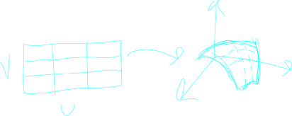

## About

a surface equation is simply an equtation which maps a 2d surface into an embeding in 3d space.

This is basically just a UV map, and we can think about it as such.

If the function is continous then lines in the uv map will get mapped to curved lines in the 3d space.

Theres lots of different kinds of 3d mappings, and they all have different effects.

A tourus is a common mapping, as is a sphere.

It should also be noted that surfaces often have more than one mapping, concider a uv-sphere and an ico-sphere. Both are very different ways of describing the same surface.
