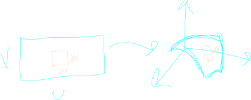
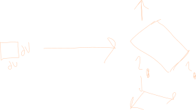
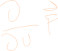
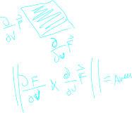
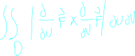
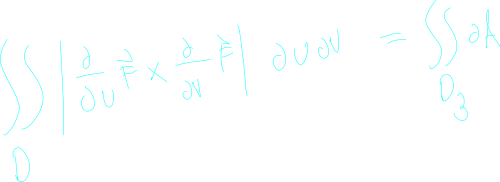
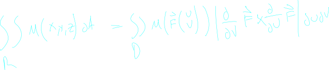

## About

there are lots of times where we want to compute the area of a surface in 3d space. 

Take for instance the surface area of a sphere centered in 3d space

## Ideas

concider a square in the input space to some function F.

This square will get mapped to some other bended square in the output space.

For **small** squares, that new output map will itself be some paralelagram in 3d space.

We know how to find the area of a parallelagram using the [[calc3.vectors.crossProduct]], the question now is what are the side lengths of that parallelagram.

moving along du in the input space results in some vectored motion of F in the output space. We know how to do this! We can take the partial derivative components with respect to u.

We can make the exact same arugment for cross_product_determinent.svg

We then get the area of the paralelagram to be the following.

follwing this all the way through, if we want to get the area along any surface, we can add together all of the infinitly tiny rectangles that make the surface. Doing this gives us the following equation:

In some sense the above integral is equal to the following:

which of course implies that dA is the same as the other infentesimals in the left equation.

Also note that there are times when we want to associate each of these tiny slices of area with some value of a function at that slice. This is similar to how we might want to find the mass of a line integral by integrating over a line and multiplying by some value.

In these instances we can modify the above integral to multiply the value of each tiny square by the "mass" or other property of that square.

This gives us the following equation:

The way that you read this equation is basically saying that we are finding the indivudal tiny mass of these rectangles and adding them all up.

> Note that of course mass is a placeholder for any function that associates a value with a given point in 3d space.

## Remarks

Note that the first integral equation (the one with du and dv) integrates over the region in the **UV** plane, and that the second integral equation with dA, is integrating in the output space generated by F.

If you run into a senario where you need to integrate a mass over a 3d surface region, you need to paramaterize the region before you can perform the integration, and build F.
