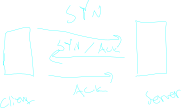
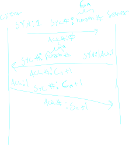

___

## Three Way three way handshake

called to start a tcp connection both the client and server need to set up memory and a sequence code to send with each preceding packet

the three way handshake is the protocol that sends this information accross

High level over view of the flags that are sent in the handshake




## Packet Flags
each packet contains the following tcp data,
best represented as a c++ struct

``` c++
    struct TCP_Header_Data {
        bool syn;
        bool ack;
        int ackNum;
        int secNum;
        /*
            other stuff
        */
    }
```

the syn and ack flags are used in setting up a connection in the above image 

the ackNum is allways + the sec num sent by the other talking enttiy, indicating what the next desired data number is

the secNum indicates what is the data number of THIS packet.

basically secNum is what is THIS packet ackNum says what this packet is responding to

the following shows the corrispondence that sets up the sequence number for each entity in the connection

a "zoomed in" look at the tcp handshake



___

## Ack Number

we increase the ack number by the number of bytes that we recive for each message that we send

> this means that the ack number tells us the NEXT byte that we want to recive from the client 

> and that subtracting 1 from it gets us the last byte we recived

### tcp buffers and ack

the client and server both buffer messages that they send over the network

these buffers are cleared, when the oposit agent sends over an Ack number indicating that the bytes stored in the buffer have been recived

___

## Seq Number

this number is allways (wanted to be) equal to the most recient
recived ack number


> it tells the listener what order our data is supposed to be recived


___

## Error Correction


assume the client sends data to the server, and that data is dropped

if the serer does not respond with it's awk, the client will wait for an amount of time and then re-send the packet

if the server sends an incorrect awk number, the client can detect it and re-send the desired bytes
