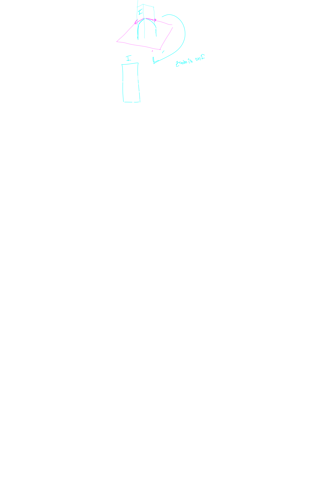
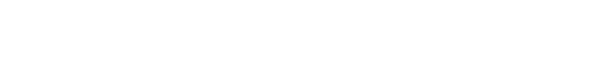
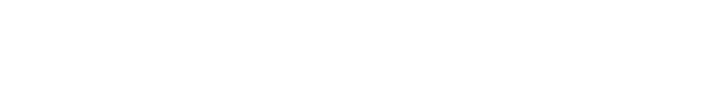
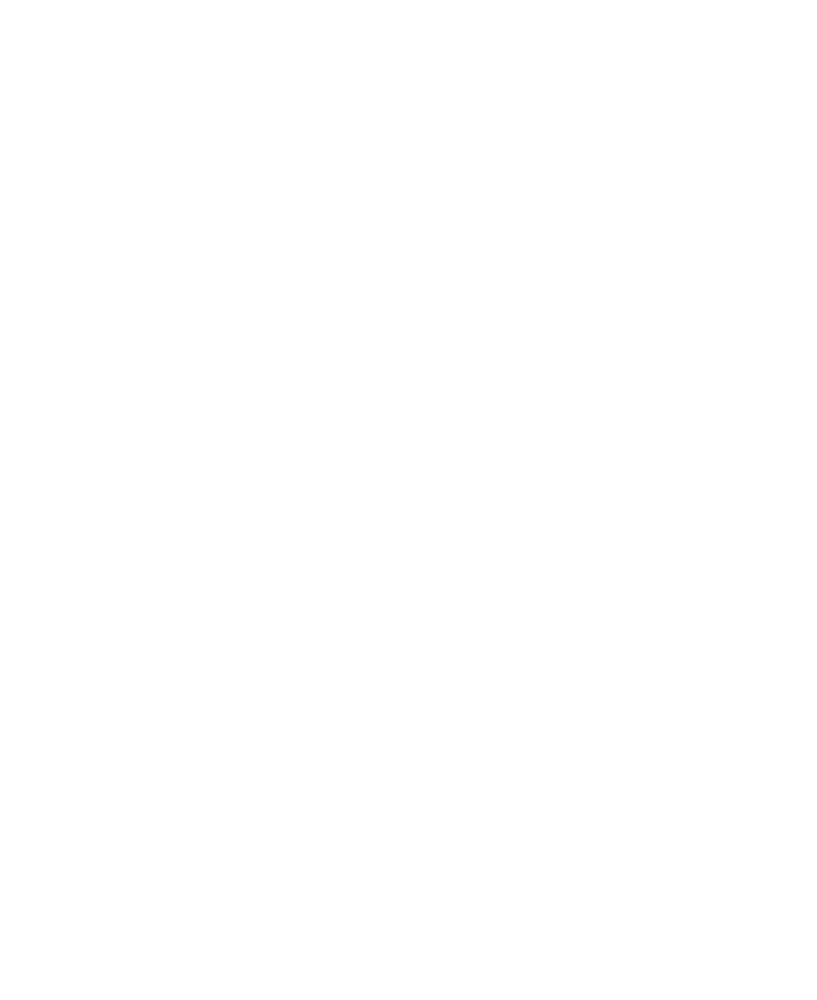

## Definition

a tangent plane serves the same purpose as a tangent line.

it is a linearization of a function which takes two variables in 3d space

in general this trick can be performed 
in higher order spaces ina ddition to 3d

we call this a linearization of the function

## Conveinent Equation

> this is only tangent if the plane is differentiable at point $$(a,b)$$

most nice functions are differntiable, so we can *usually* use this equation.

The following represents the tangent for a plane in 3d

