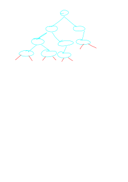
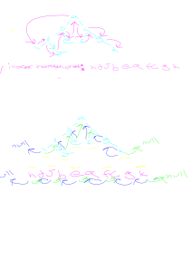

# Threaded Binary Tree

---

## forward

conscider the following binary Tree

note that some of the leaves point twoards nothing, we could use those pointers to store useful information

enter threaded trees

we can use these null pointers to avoid the stack and quee

---

## Pragmatics

there are two types of threaded trees

- single threaded
    - we only use one null pointers
- double threaded
    - we use two null pointers

the left null pointer points to the predecessor

the right null pointer points to the successor

> We use inorder traversal in order to determin if a node is the predicessor or not
    
see [[DataStructures.BinaryTrees.Traversal]]

concider the following example 

the purple lines indicate the path of a preorder search

the blue lines indicate the left null pointers pointing to the predicessor

the green lines indicate the right null pointer pointing to the successor

note how the successor and the predicesor are coming from the inorder traversal search

---

## Traversal

The whole point of threaded trees is that they allow for faster stackless traversal

amusingly they allow for preorder and postorder traversal as apposed to the inorder used to create them

for pre order traversal

    1. visit the current node
    2. 
    if it has a left decendent
        go to left and repeat 2
    elif it has a right decendent:
        go to right and repeat 2
    else:
        # it is a leaf
        go to the right decendent of the predecesor thread and repeat 2

---

## Dummy Node

There are wispers of a dummy node used in this algorithm to point the null pointers to indicating the end of the tree

further research here is required

[youtube vid](https://www.youtube.com/watch?v=ffgg_zmbaxw)
