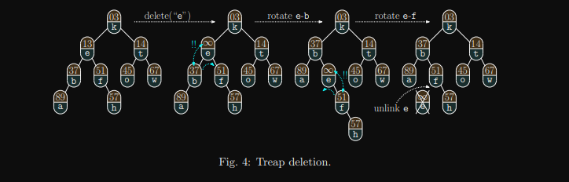

___

## About

[[DataStructures.Heap]]s suffer from a lack of ordering
> this allows rapid access to the "best" element in the heap, but any other element is awkword

Binary search trees are ideal for searching, but insertion is is difficult
> We get ordering for free here, but not balance

**enter the treap**

> A treap is a binary search tree that associates priorities with elements and organizes itself into a heap using these priorities

in order to maintain these properties instead of swapping nodes like in a heap, we **rotate** nodes until they are in their proper level.

## Deletion

to delete, we rotate the node that we want to delete until it has only one child or no child, and then remove it from the tree (connecting its (the deleted nodes) child to its grandparent).

Note that if we have a tie for rotation children, we rotate based on the heap number to have the "better" node on top.

Example deletion algorithm.
Note that in this example "greater" priority indicates a lesser value

## Key Ideas
> data inserted into a treap has two components, one for the binary tree insertion, and one for heap "swapping" to indicate of we should rotate.

> We insert using a binary tree insertion algorithm.

> Then run the heap algorithm on the inserted node, but replace swapping with rotations.

## Random Efficiency

it appears that if you use random numbers for the priority of a treap, it ends up generally giving you a balanced binary tree. Thus many treap algorithms feed random numbers into the values in the tree!
