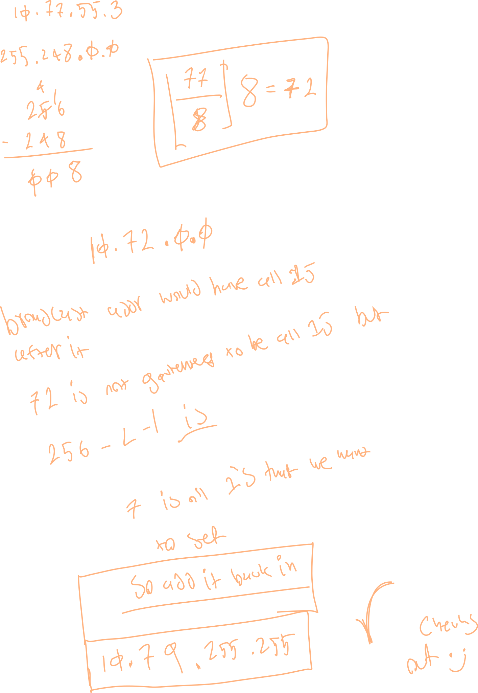

## About

the broadcast address of a subnet is the address that sends data to all members of that subnet.

visually it contains the subnet network address on the left, and all ones on the right.

To get the address, we can add the number that we use to divide out the network octet when creating the subnet ip [[Networking.NetworkLayer.Addressing.ipv4.subnetting.SubnetId]]

this is because that number represents the 1s at the end of that octet.

