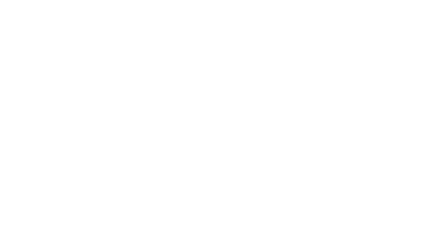

## About
line integrals over a conservative vector field are independent of the path that you follow.

see [[calc3.multiVariable.Integral.line_integral]] for more notes on this.

consider the second derivatives of f with gradients. If the function is continous fxy = fyx.

