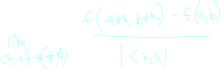

___
## Notation

some quick notation notes and comparisions to single derivative case

the the first set of equations is for a single variable

the second is for the directional derivative case

[[calc3.multiVariable.derivatives.directionalDerivatives]]
___

## Forward

with one variable derivatives represent slope

this means that for small h then the function is going to be ALMOST a linear equation

slope is L

=>

> So a function to be differentiable <=> It is "localy" linear

___

## Multi Variable Case

We would like multi variable functions to have an analagous property. That is when we zoom in it is diferentiable if it is "linear"

for a function to be linear we have

**OR**

basically we have the function is a sum of single variables times some constant

for several variables if we might think we could re-use the limit defintion, but extend it with additional sliders

unfortionetly this limit almost never exists, its not super useful.

so we need a new definition for the derivative.

One such definition is [[calc3.multiVariable.derivatives.directionalDerivatives]] Which let us take the single derivative in a given direction

