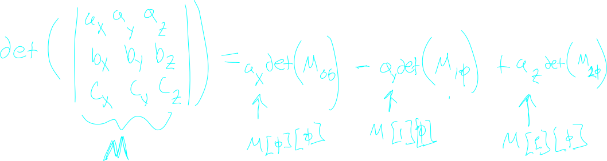
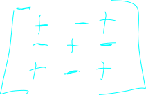
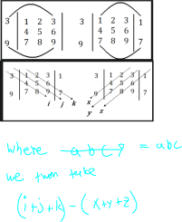

## About

the determinent represents how a given matrix transformation transforms area in the vector space. 

In other words, it is the area of the transformation of a unit square into a new vector space.

## Computation

The determinent can be computed recursivly by adding the sub matri

Basically you travel along a given row or collumn and add and subtract the [[matrixAlgebra.submatrix]] your current element times that element.

Note that the top left corner of the matrix is "posotive" in the sum sequence and all other elements of the matrix inherite their "posotivity" as a result. You can think of it like white and black on a chess board.

> an implimentation of this recursive approach in haskell can be found here:
> [vector.hs](./assets/code/vector.hs)

#### 3d trick

in 3d there is a convinent trick to compute the determinent **as a human** and abstract away a lot of the tedius recursion.

Theres a lot of versions of this involving copying things down in differnet ways, but the following is a convinent one is from [geeks for geeks](https://www.geeksforgeeks.org/trick-to-calculate-determinant-of-a-3x3-matrix/) and works wonderfly.

