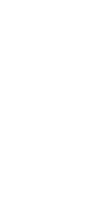

## About

greens therom is an interesting relation
between the integral along the edge of a curve and the integral along the area of a curve.

## Proof

this is more of a scratch proof than anything, but it contains some useful ideas.

