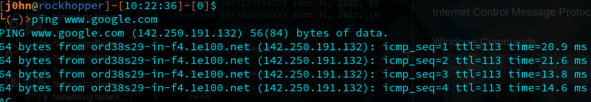

## Internet Control Message Protocol

## Windows Commands

```bash
ping <ip address | hostname>
```

```bash
tracert <ip address | hostname>
```

## Linux Space

### Ping Examples




we can see the round trip time of thisprocess in the print out of the icmp command

Trace route example


