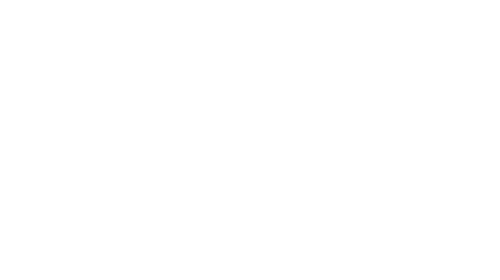
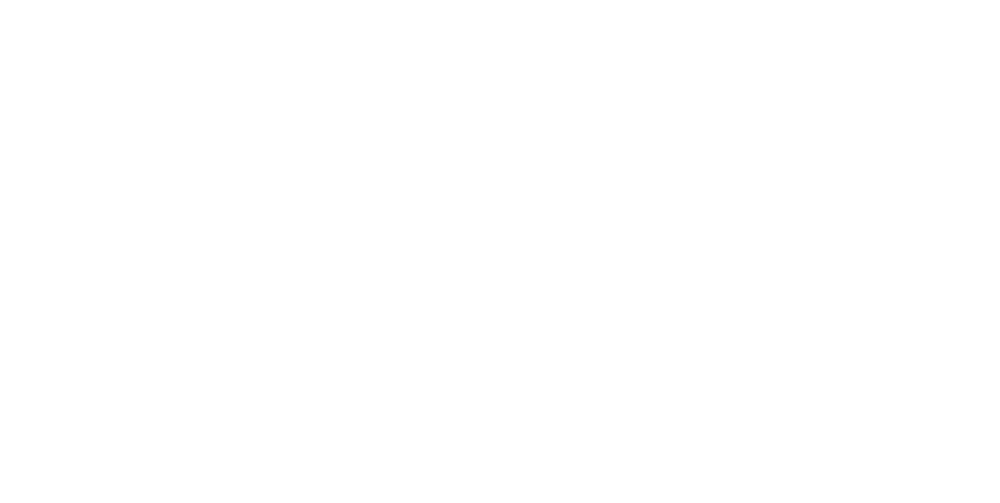
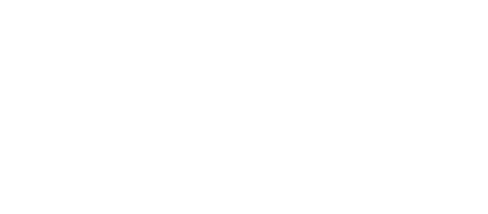
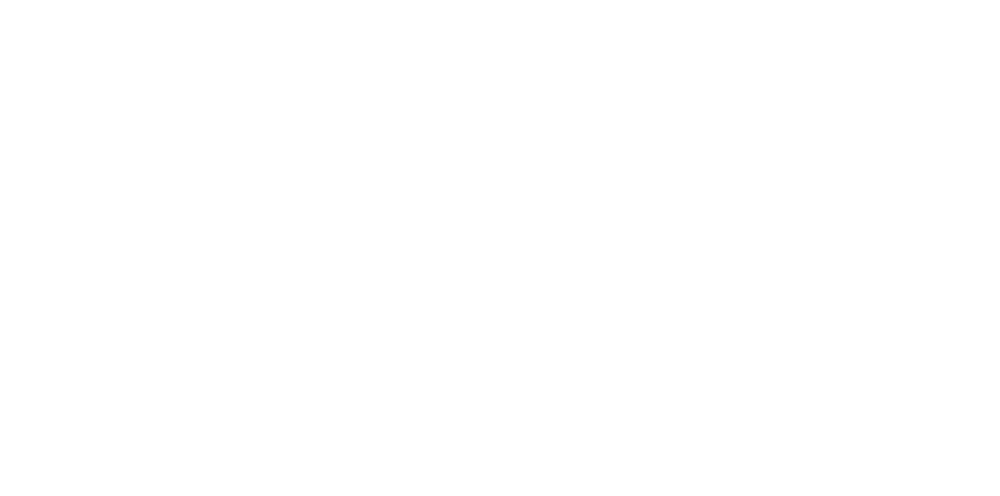
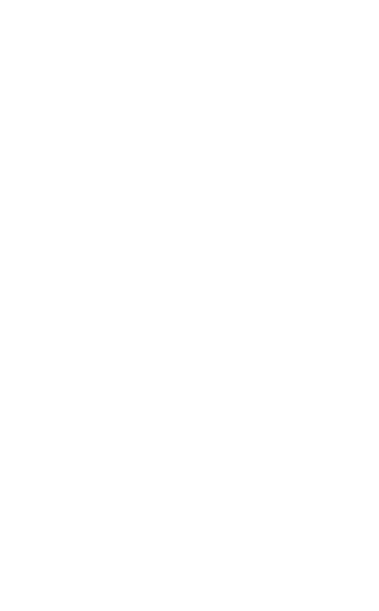
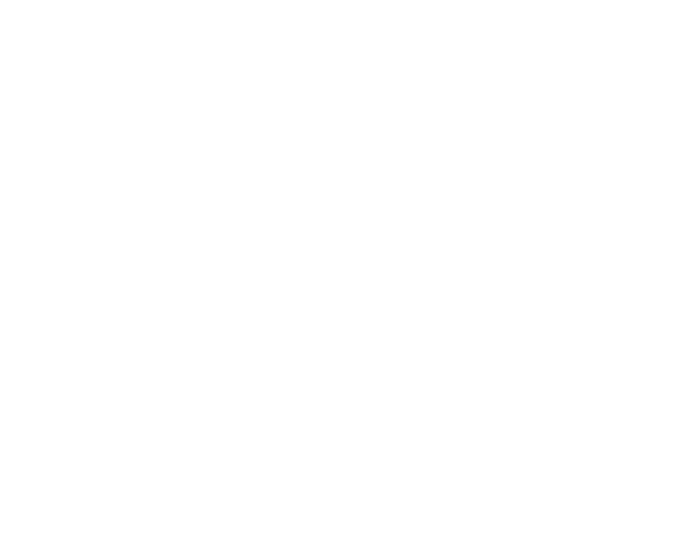
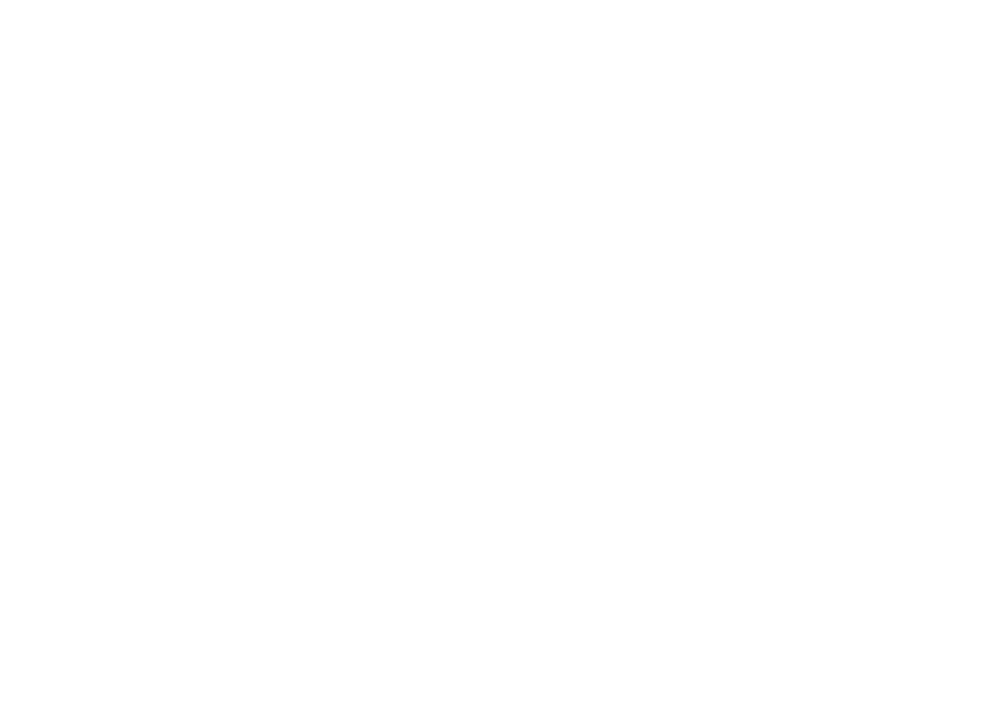
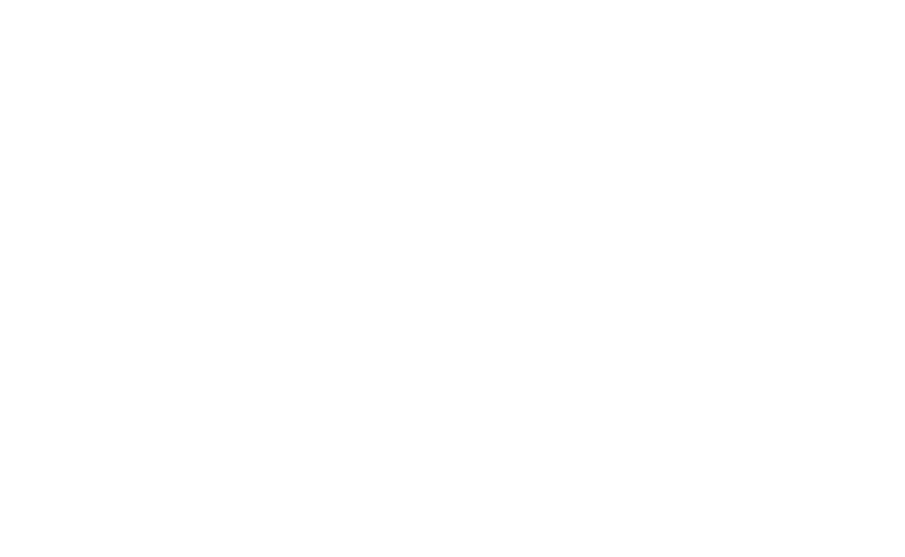

## About

there are two basic ideas for extrema in higher dim calc

1. local extrema
2. global extrema

with local extrema bieng the nearest extream value and global bieng the point where the function is **globaly** at the highest value

we know how to find the maxima in these cases using ideas of concavity and the second order derivative

of course for more than 1 function, we need to adjust how we think about this.

## Multi Variable

we can think about the tangent bieng horizontal as indicating that x and y are **not** changing.

We can generalize this to any variable by saying that the [[calc3.multiVariable.gradientVector]] of the function is zero at the critical points.

For two variables there are some additional difficulties that we do not deal with in 2d.

for a range of inputs we can have many different shapes for our range, its no longer just a straight line.

We can still find critical points in and on the boundry, but we now have to test the **boudnry** to find maximums that could be on the edge of the range.

note that the boundry is a 1d boundry for our 2d shape. We can generalize this to any dimesnion Dd where we will have a D-1 boundry. 

Using this we can recursivly solve to get the edges of our boundry in any dimension.

## Saddle point
A saddle point is a point where one direction has posotive curvature, and another direction has negative curvature, hence looking like a saddle.

## Examples

see [[calc3.multiVariable.derivatives.maxima.hessianmatrix]]

we use the determinent of the  [[calc3.multiVariable.derivatives.maxima.hessianmatrix]] to determin if we are a maximum or minimum, check the notes for ref.

an example of a function which has a saddle point despite fxx and fyy bieng positive.

example 2

example 3

