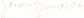
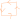
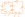
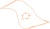
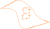

## Definition

where c is the boundry along the surface s, n is the normal of that surface, and F is some vector field

note that to find n we can use the cross product of the [[calc3.multiVariable.gradientVector]] paramaterization of s

## Intuition

concider a rotating square.

we can measure the rotation of that
square using its [[calc3.vectors.curl]]

Now concider what happens when we place two such rotating squares side by side.

Notice how the rotations of the squares cancel in the middle of their connections.

This leads us to the interesting fact that for the case of squares, we can use the rotation of **their boundry** to determin the sum of rotations of the two squares.

Now concider this inside of some larger surface.

As we attach more and more squares to the initial starting square, we compute the total sum of curl over the surface, but notice that from the observation above the border of those squares allways computes the sum of their rotation.

Thus as we add more and more very tiny squares, the sum of the total curl of the surface AND the sum along the border of the surface approach the same value!
