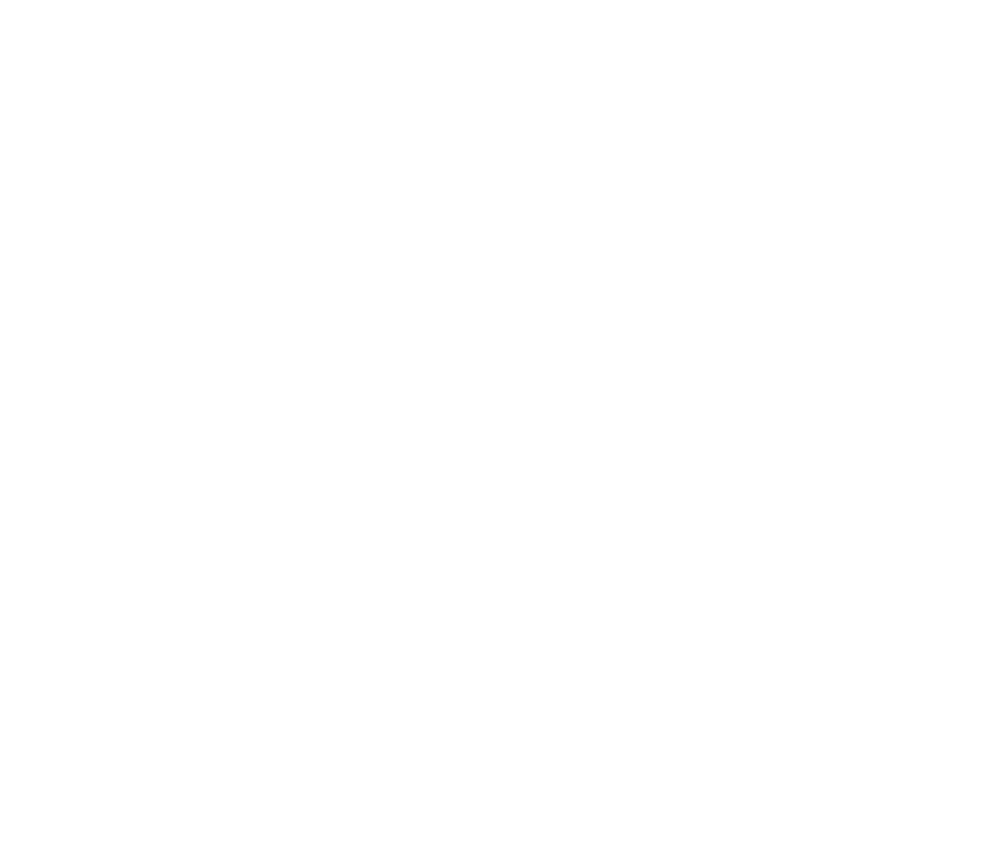

___

## Forward

just because we can take the partial derivatives of a function f **does NOT** mean that the function is differentaitable

Concider 

all of the direction derivatives of this funciton exist, and yet we cannot satisfy the property where we build the other derivatives from the partial derivatives

> thus we cannot find the directional derivative using partial derivatives
